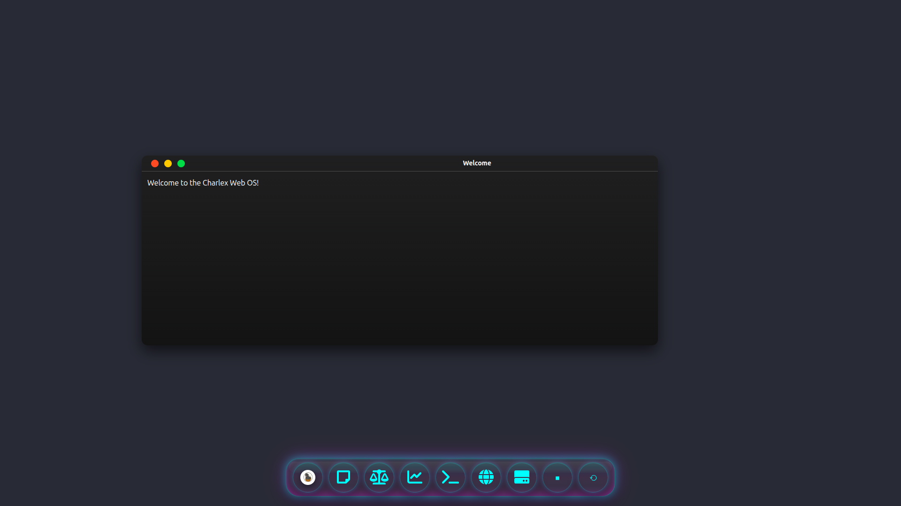

# Charlex WebOS: Zero-Trust Web-Based Operating System Simulation

[](https://www.python.org/)
[](https://flask.palletsprojects.com/)
[](https://www.sqlalchemy.org/)

A lightweight web-based OS simulation refactored with **Flask** for a robust Python backend, enabling persistent data management while keeping the frontend simple. Built by a [Googler](https://g.dev/amzy31) who appreciates Flask's elegance for backend logic.



## 🚀 Quick Start

1. Clone or download the repo:
   ```
   git clone https://github.com/yourusername/charlexwebos.git
   cd charlexwebos
   ```

2. Set up virtual environment and install dependencies:
   ```
   virtualenv venv
   source venv/bin/activate  # Windows: venv\Scripts\activate
   pip install -r requirements.txt
   ```

3. Run the Flask application:
   ```
   export FLASK_APP=app.py
   flask run
   ```
   Or:
   ```
   python app.py
   ```

4. Open [http://127.0.0.1:5000](http://127.0.0.1:5000) in your browser.

5. Experience the OS with backend-powered persistence!

## ✨ Features

- Drag windows around the desktop.
- Launch apps via dock icons (Notes, CPU Monitor, Shell, etc.).
- Encrypted notes with save/load functionality.
- Simulated Linux shell with basic commands.
- Theme switching (macOS/Windows styles).
- Simulated power controls (reboot, halt).
- File explorer for encrypted files.
- Backend persistence for window states (positions, sizes, z-index) via Flask API.

The frontend is served unchanged, but Flask handles all logic for scalability and data storage.

## 🛠 Tech Stack

- **Backend**: [Flask](https://flask.palletsprojects.com/) – Python's micro-framework for building web APIs quickly and efficiently. Ideal for adding persistence without complexity.
- **Database**: [Flask-SQLAlchemy](https://flask-sqlalchemy.palletsprojects.com/) with SQLite for simple, file-based storage.
- **Real-Time**: Flask-SocketIO for WebSocket support (ready for extensions like live updates).
- **Frontend**: HTML, CSS, JavaScript – served statically by Flask.
- **No Bloat**: Minimal dependencies; Flask keeps it lightweight and Pythonic.

Flask is the star here: It transforms a static site into a full-stack app with clean, readable code. Perfect for developers seeking power without overhead.

## 📡 API Endpoints

Flask provides a RESTful API for window management. Integrate with frontend JS using fetch or XMLHttpRequest:

- `GET /api/windows` – Fetch all windows (JSON response with states).
- `POST /api/windows` – Create window (body: JSON with window_id, left, top, width, height, etc.).
- `PUT /api/windows/<id>` – Update window (e.g., after drag/resize).
- `DELETE /api/windows/<id>` – Remove window.

Example curl test (app running):
```bash
curl http://127.0.0.1:5000/api/windows
```

Example JS integration:
```javascript
fetch('/api/windows', { method: 'POST', body: JSON.stringify({window_id: 'terminal', left: 100}) })
  .then(res => res.json())
  .then(data => console.log('Created:', data));
```

Database file: `charlexwebos.db` (auto-created).

## 📁 Project Structure

```
charlexwebos/
├── app.py                 # Main Flask app and routes
├── models.py              # SQLAlchemy models (Window)
├── requirements.txt       # Dependencies (Flask, SQLAlchemy, SocketIO)
├── templates/             # Jinja2 templates
│   └── index.html
├── static/                # Served assets
│   ├── css/
│   ├── js/
│   ├── icons/
│   └── img/
├── venv/                  # Virtual env (gitignored)
└── README.md
```

## 🧪 Testing

- **Frontend**: Load http://127.0.0.1:5000 – verify UI, drag windows, launch apps.
- **Backend API**: Use curl or Postman to test endpoints (see above).
- **Persistence**: Create/update windows via API, refresh page – states should persist.

Run `flask run --debug` for development mode.

## 🤝 Contributing

Fork, branch, commit, PR! Focus on Flask extensions, API enhancements, or backend features.

## 📄 License

MIT – See [LICENSE](LICENSE).

© 2020-2025 AMZY31. Powered by Flask for the modern web.

